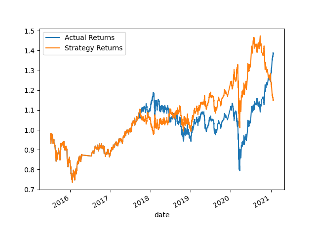

# Challenge-14

***Machine Learning Trading Bot***

In this Challenge, you’ll assume the role of a financial advisor at one of the top five financial advisory firms in the world. Your firm constantly competes with the other major firms to manage and automatically trade assets in a highly dynamic environment. In recent years, your firm has heavily profited by using computer algorithms that can buy and sell faster than human traders.

The speed of these transactions gave your firm a competitive advantage early on. But, people still need to specifically program these systems, which limits their ability to adapt to new data. You’re thus planning to improve the existing algorithmic trading systems and maintain the firm’s competitive advantage in the market. To do so, you’ll enhance the existing trading signals with machine learning algorithms that can adapt to new data.

***Instructions:***

Use the starter code file to complete the steps that the instructions outline. The steps for this Challenge are divided into the following sections:

***Establish a Baseline Performance***

***Tune the Baseline Trading Algorithm***

***Evaluate a New Machine Learning Classifier***

***Create an Evaluation Report***

***Technologies***

This project is written in Python with the following libraries:

pandas

numpy

sklearn

**Evaluate a New Machine Learning Classifier**

*Did this new model perform better or worse than the provided baseline model?*
Yes, this model did perform better than the provided baseline model.

*Did this new model perform better or worse than your tuned trading algorithm?*
This model performed better than the tuned trading algorithm.

**Contributors**

I had help with this challenge from this weeks module examples and a tutor.
